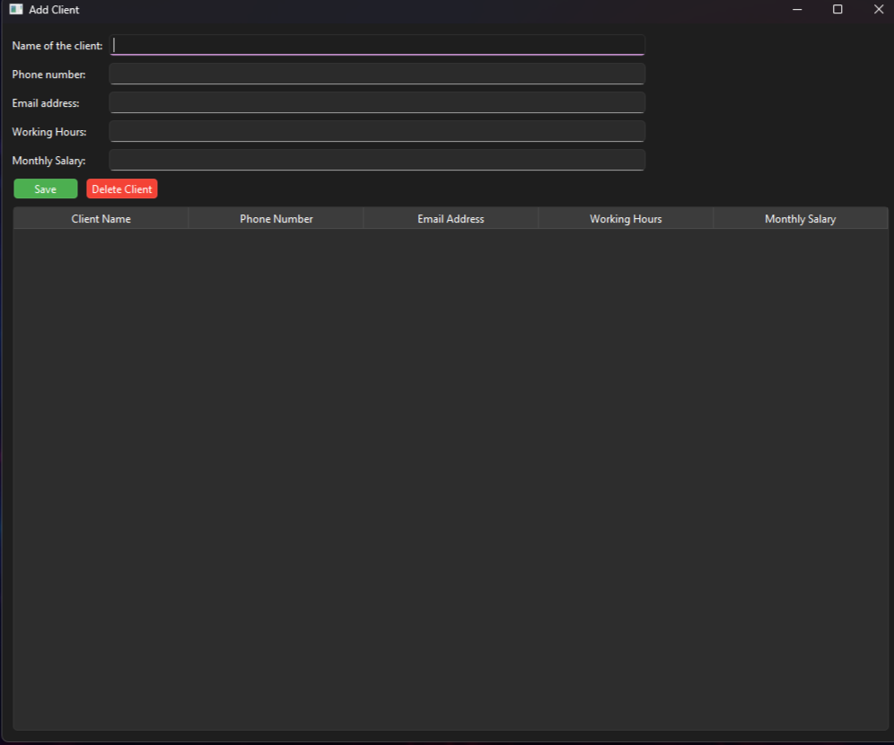

# Client Management System

A professional, high-performance desktop software solution built using **Python** to streamline client data management. The application features a dynamic and modern graphical user interface (GUI) designed to maximize user efficiency and structural data handling.

## 🚀 Features
* **Intuitive Dual-Window Architecture:** Seamless navigation starting from a sleek main dashboard that bridges into specialized sub-windows for adding, modifying, and updating client information.
* **Comprehensive Data Tracking:** Supports complete management of crucial client metrics, including:
  * Client Name
  * Phone Number
  * Email Address
  * Working Hours
  * Calculated Salary/Financial Packages
* **Dynamic Table Matrix (Data Grid):** Built-in real-time preview table tracking client records immediately upon modification.
* **CRUD Functionality:** Integrated data operations allowing administrators to easily add or delete clients with simple, responsive action triggers (e.g., *Delete Client*).

## 🛠️ Tech Stack & Concepts
* **Language:** Python
* **GUI Architecture:** Object-Oriented Programming (OOP) paradigms for clean code architecture and modular window triggers.
* **Data Management:** Algorithmic backend logic for data validation, entry extraction, and real-time interface rendering.

## 📸 Interface Preview
*Below is a look at the desktop dashboard framework during operations:*

